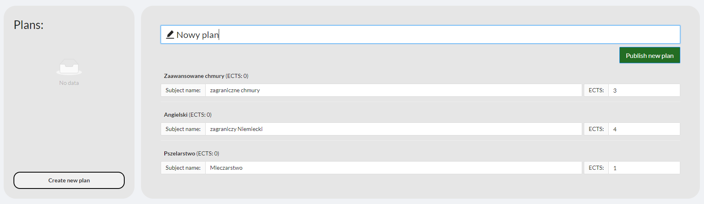
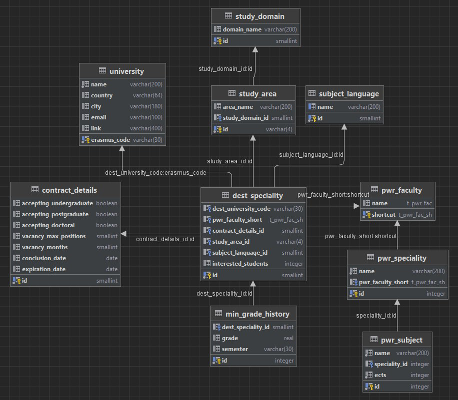

# Erasmus-Signup

This is a web application created for a team project in Wroclaw's University of Science and Technology. Its purpose is to modernize the process of signing up for the Erasmus program, which, at the time of working on this project, was revolving around an excel spreadsheet.

## Features

The functional features of the application include:

- viewing a list of universities with filtering capabilities
- viewing details regarding a selected university and field of study
- viewing and managing user profile
- recommendations based on the user's profile
- rating and opinion system
- schedule composing
- approving student's schedule by the coordinator

## Architecture

The Erasmus-Signup system is built in a microservices architecture. It consists of a client application, five API services with their own databases and a message broker for communication between the services. One of the APIs also communicates with a third-party service for OAuth authentication and retrieving user information. The USOS IdP provides the system with a JWT Token, which is later used for all communication between the services.

All system components are contenerized using Docker.

## User Interface

The main page of the application contains a list of all possible destinations with a filtering panel above.

Authenticated users can also see recommendations based on their preferences.

Clicking on any university redirects the user to the details page. There, one can find all the university data relevant in terms of the Erasmus program, along with a list of available fields of study and students' opinions.

All the information about the logged in user can be accessed through the profile page. From there, students can navigate to their personal notes, schedule, subjects and preferences.

The notes page allows creating a simple text notes of one of three predefined types: common, plan-related and specialty-related.

Below you can see how the note creation looks like.

Before a student can create a plan, they must first fill a list of subjects that they would have in their home university. This list can be viewed and edited in the subjects page, accessible from the profile page.

These subjects are then visible on the plan creation page, where a student must choose a counterpart from the chosen university's schedule for each of them.

Saved plans can then be sent to the coordinator for approval. The coordinator can also choose to reject a plan with a reason in the attached note.

## Database

Each service has its own dedicated database.

### University DB

### User DB

User's data is retrieved from the Identity Provider.

### Plan DB

### Note DB

### Opinion DB

## Technology Stack

The entire project was implemented with the following technologies:

| .NET                                                | React                                               | TypeScript                                          | PostgreSQL                                          | Docker                                              | RabbitMQ                                            |
| --------------------------------------------------- | --------------------------------------------------- | --------------------------------------------------- | --------------------------------------------------- | --------------------------------------------------- | --------------------------------------------------- |
|  |  |  |  |  |  |

The client application is written in **TypeScript with React framework**.  
The services are written in **C# and ASP.NET Core**.  
The message broker is **RabbitMQ**.  
The database is **PostgreSQL**.  
All contenerized using **Docker**.
